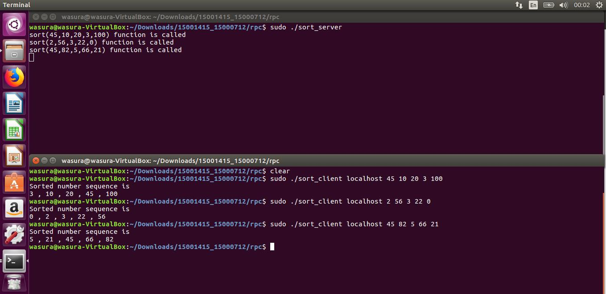

# RPC-Sort
DESCRIPTION
------------
This program makes a Remote Procedur Call(RPC) to a server program which can sort the 5 numbers and returns the result

This program is developed by rpcgen on Ubuntu 16.04 machine and also tested on Ubuntu 16.04 machine

INSTRUCTIONS
-----------
1. Check whether you have installed rpcbind by just typing "rpcinfo" in your terminal
   If not install it by running "sudo apt-get install rpcbind"

2. Navigate to the rpc directory which is included in this .zip file.
   To run this program open 2 terminals on rpc folder

3. In one terminal run server file by typing 
	sudo ./sort_server

4. In the other terminal run client file by typing
	sudo ./sort_client localhost 15 2 89 5 4 

(in the above line, last 5 numbers are example numbers)

